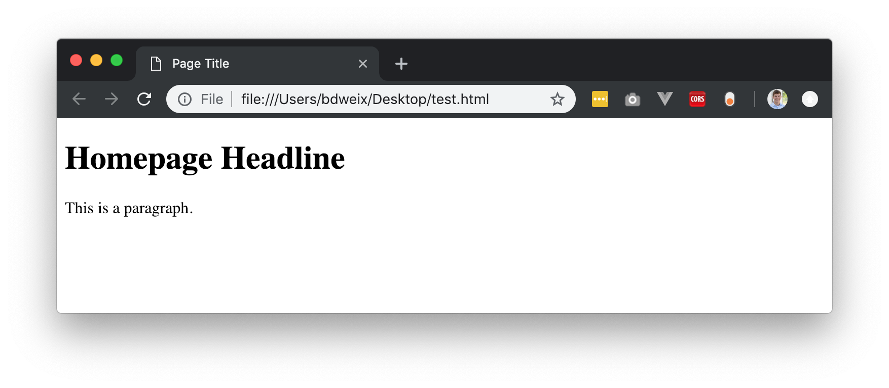
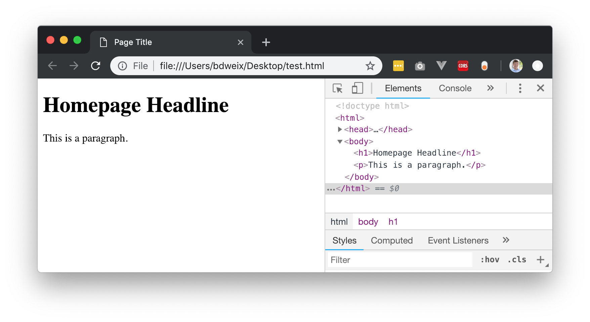
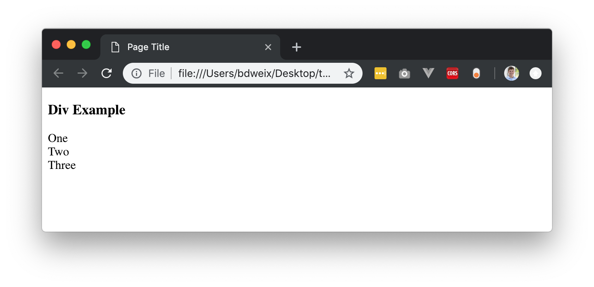
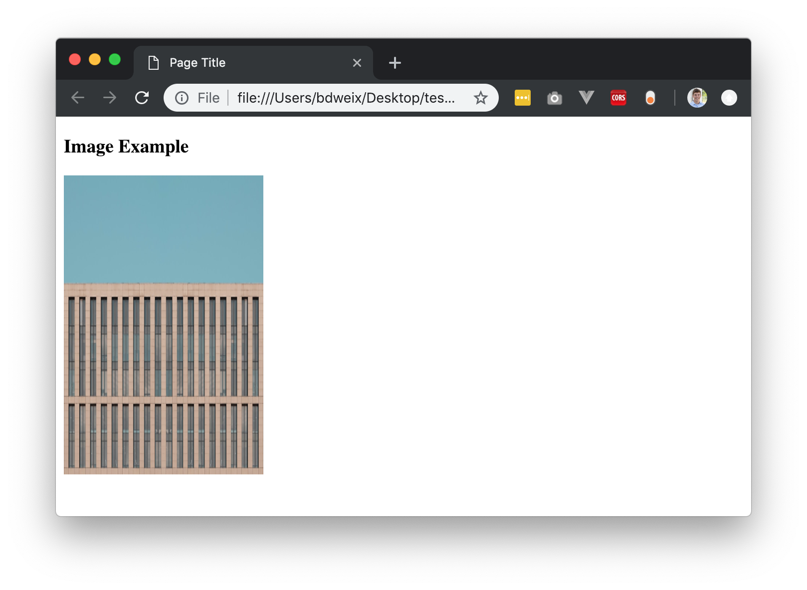
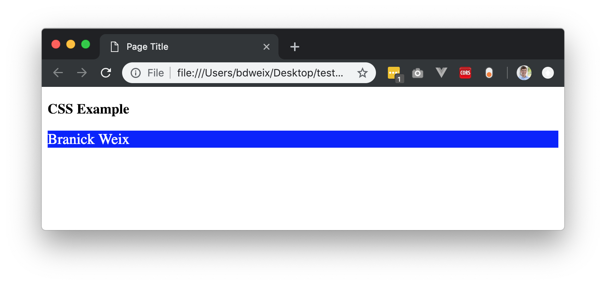
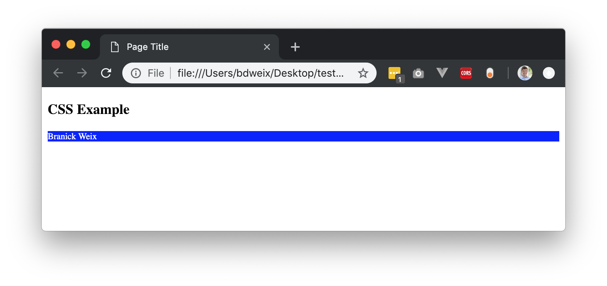
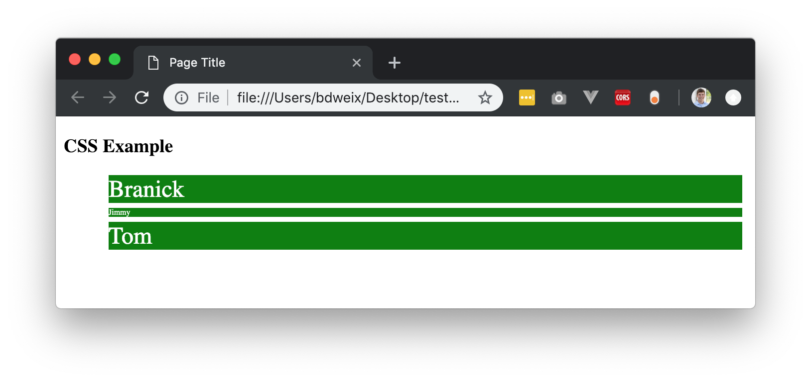

# Week 2: HTML + CSS + Intro to Express

As we learned in the last week, the internet is all built on simple text! Even this website that you are reading right now is designed and rendered from simple lines of text. The language of this text is called `HTML` and it stands for **Hypertext Markup Language**. You can start to think of your web browser as a viewer that can "view" these files. Similar to how you use Microsoft Word to open and view Word documents, you use your web browser to view HTML files. We will discuss later on how CSS fits into this picture as well.

## Part 1: HTML + CSS

### Tags
Everything in HTML is built upon HTML tags. These tags are denoted with the carrot `<` `>` symbols. You can think of HTML as being compromised of sentences that represent different page elements that you see. For example, at the top of this page there is a search bar, this is simply an input feild that lets users type into.

Each tag comes in a pair, and has a starting and ending tag. They are usually denoted such that `<tagName>` begins like this, and ends with a backwards slash such as `</tagName>`. Everything between the two tags is the content, and the tags tell the browser what kind of content it will be.

**Note:** you must always have an opening and closing tag, otherwise your page will not load properly.

#### Tag Types
There hundreds of tag types! You can view a full [list here](https://www.w3schools.com/tags/ref_byfunc.asp), but don't worry, you really only need to understand a few types to get things working. Here's the main ones:

| `<html>`        | Defines an HTML document                                    |
| :-------------- | :----------------------------------------------------------- |
| `<head>`        | Defines information about the document                       |
| `<title>`       | Defines a title for the document                             |
| `<body>`        | Defines the documents body                                   |
| `<h1>`...`<h6>` | Defines Headings of descending size                          |
| `<p>`           | Defines a paragraph                                          |
| `<br>`          | Inserts a single line break (Note: you do not need a closing tag here) |
| `<hr>`          | Inserts a line break (Note: you do not need a closing tag here) |
| `<!--`...`-->`  | Defines a comment (will not appear in the browser)           |
| `<div>`         | Defines a section in a document                              |
| `<span>`         | Defines a section in a document                              |
| `<input>`         | Used to accept user inputs on a page                              |
| ``         | Inserts an img (Note: you do not need a closer tag here)                              |
| `<a>`         | Inserts a link (Note: href attribute is often required                            |

### Basic HTML Document

Now that we know some of the basic tags, let's take a minute to look at a basic HTML document. Just like any Word document you'd right, there some required components of any `HTML` file. This is what a standard document looks like:

```html
<!DOCTYPE html>
<html>
    <head>
        <title>Page Title</title>
    </head>
    <body>
        <h1>Homepage Headline</h1>
        <p>This is a paragraph.</p>
    </body>
</html>
```

As you may notice, tags become nested within other tags. You can read this by looking at the indendation structure. There is a `<html>``</html>` tag pair that wraps the entire document, this tells the browser that everything between the two tags is an HTML document. You'll then see that the document has two main sections:

1. `<head>` - The head is at the top of the document and used to define page information and attributes. In this case we define the page title (this appears at the top of your browser), and we can define other attributes such as language and author as well.
2. `<body>` - The body is where the majority of the page content is hosted. This will have all of your text and features and images.

What does this HTML look like now? 

We can see at the top of our browser the tab shows the "Page Title", which is specifed between the `<title>` tags in the document `<head>`. If you change this title, it will change in your browser! Next we will see that the page has the largest sized header value (`<h1>`) with the words "Homepage Headline". Finally you can see the body text being display. 

Rememeber last week when we learned about Inspecting elements in Chrome? We can do that now too. Simply right click (control-click on Mac) and hit "Inspect". You will now be able to interact directly with the web page HTML, you can even change values.



### Creating your own HTML Document

Before we dive into more details about HTML, try setting up your own HTML document with what you've learned so far. Open Atom and in hit `Command N` (Mac) to create a new file, or go to the toolbar and hit `File > New File`. In the pop up window, enter the name for your new file: `MyWebpage.html`

You now have a blank HTML document that you can write anything you want in! Try copy/pasting the template we provided above and changing around the values. Go ahead and start playing some of the additional tag types as well. Once you want to see it, simply save the document to your Desktop (or wherever you want). Then go to the document and click it to open - it'll autoamtically open in your browser! Congrats you just made your own website.

### Div's 

The div tag is a block level HTML element. It is used to **divide** or **section** of other HTML tags in to meaningful groups. A perfect example of the use of a div tag is to designate an un-ordered list:

``` html
<div id="navigation_list">
  <ul>
    <li><a href="/home">Home</a></li>
    <li><a href="/about">About</a></li>
    <li><a href="/contact">Contact</a></li>
  </ul>
</div>
```

As you can see, this list is wrapped by a `<div>` tag with the ID of "navigation_list". We'll get into what `id` and `href` means in the following section, but look at the interior tags here. We have a `<ul>` tag which stands for `Unordered List` and within it are any number of `<li>`'s which stand for `List Items`. Another way to think about div's is that they are the "horizontal rows" on your webpage. Just as you read a document from left to row, row by row, your browser renders a webpage line by line. 

Let's look at what another example looks like, here we are placing three divs next to each other.

```html
  <h3>Div Example</h3>

  <div>One</div>
  <div>Two</div>
  <div>Three</div>
```

Note: this code is all within the `<body>` tag, I'm excluding that for redundacy here. This code generates a view looking like this: 



### Span's

Spans are very similar to divs, however spans are often used to display things within a single line. Let's look at the same example but using spans instead:

``` html
 <h3>Div Example</h3>

  <span>One</span>
  <span>Two</span>
  <span>Three</span>
```

This builds a view with everything in line:


I know these seem basic, but these are the building blocks of the internet! You'll quickly see how we can use CSS to turn basic examples into fancy websites.

### Tag Attributes

So far we've avoided talking about Tag Attributes, these are a vital part of the HTML language. Attributes are writen **within** the first `<starting>` tag. Here's an example of the `<a>` (link) tag with some attributes:

```html
<a href="www.google.com" class="link_class" id="google_button">Click to go to google!</a>
```

I know this looks like a lot, but let's break up what's going on here. As you can see, the attributes are denoted such that `key`=`"value"`. You'll see that for every key you need it to be followed by an equal sign, which in turn needs to be followed by a string (hence the double quotes to signify a string).

The first attribute we have here is the `href` attribute, this is an attribute that is specific to the `<a>` tag.  It stands for `hypertext reference` and is the link where we want the link to go! This means when a user clicks on the text "Click to go to google!" they will be brought to "www.google.com". Sometimes users will be linked to other pages on your website or even other websites entirely. 

The second attribute is the `class` attribute, and this is one of the most important attributes that you will see almost everywhere. This defines the class of CSS that will be used. We'll cover this in the CSS section.

Finally we have an `id` attribute that is set to "google_button". This is a **unique** identifer that represents this `<a>` tag. Note: id names must be unique and cannot be reused anywhere, whereas class names can be (and should be!) reused everywhere.

#### Example with Images

Let's take a look at the `` tag and see how we can use attributes to display an image. We'll be using images that are hosted from [Unsplash](https://source.unsplash.com/). This website will provide us with free images. A standard image take looks like this:

```html

```

As you may remember, we do not need a closing tag with an ``. The first important attribute for img is that "src" attribute, which defines the source of the image. In this case we are using the random image link from Unsplash. The following two attributes are straitforward then, `width` and `height`. These are defined in `px` (pixels) which say how much room the image should take up. All said and done it looks like this:



As you can see, we inserted an image which is of size 200x300 pixels.

### List of Potential Tag Attributes

There are hundreds of potential tags and attributes, but you only need to know the basic ones. Here's what we recommend knowing:

| Attribute | Description                                                  |
| --------- | ------------------------------------------------------------ |
| class     | Associates element with CSS class                            |
| style     | Opens inline CSS options                                     |
| id        | Unique identifier for the element                            |
| src       | Used to define image sources                                 |
| href      | Used to define link destinations                             |
| title     | Sets the title of an element (good for SEO and accessibility) |

## Introduction to CSS

Now that you've been introduced to the basics of HTML, you're probably wondering how in the world a beautiful looking website like Facebook can be built with just those components. Well it can't! Not without CSS that is. CSS stands for `Cascading Style Sheets` and these let you define how page elements look. HTML lets you create the structure of a page, and CSS lets you paint/design what that structure looks like. You wouldn't use CSS to move an element to a different position on the page, but you would use it to make the element a different color.

### General Style Properties

Every element on the page has a set of CSS styles that can be applied to it. There are some basics which apply to all. Let's use an "inline" style tag to experiment with some of these on a `<div>` with our name in it:

```html
<div style="color:white;background-color:blue;font-size:20px;">
    Branick Weix
</div>
```

You can see we are defining a number of CSS attributes, all seperated by the `;`. Within each CSS attribute we have the pattern of `key`:`value`, where they are seperated by a colon sign. Our first attribute is the `color` attribute which sets the text color of whatever is within that element (and sub-elements). The `background-color` attribute sets the background color, and `font-size` sets the font size. Here's what it looks like:



As you can see, my name is now the color white, on a blue background and set to size 22px font. Note: why does the blue go all the way to the end of the page? That's because this is a div and they take up an entire row at a time! While my name only takes up a small amount of space, the actual div containing my name takes up the entire width of the page. Try this on your own and experiment with see how much space a div will take up vs. a span.

### Attribute Scope

Now what happens if we have a div within a div? What about something like this, what styling should the interior element follow:

```html
<div style="color:white;background-color:blue;font-size:20px;">
    <div style="font-size:12px">
        Branick Weix
    </div>
</div>
```

What happens here is that **unless explicity over-written, styles will descend to all of their children**. This means that my name should also have a blue background and be in the color white. What about font-size though? Because this is set on a lower element as well, my name will assume the font-size of 12px, because that is the closest defintion to the text. The output looks like this:



As you can see it looks very similar to the previous example, but my name is now smaller because that was the only differing styling.

### Available Attributes

There are quite literally hundreds of style attributes available and some only available with certain elements. There is a lot of overlap however and often these styles can be used on any element. Check out the [complete list here](http://www.stylinwithcss.com/resources_css_properties.php).

| CSS Style        | Description                                          |
| ---------------- | ---------------------------------------------------- |
| color            | defines the text color                               |
| background-color | defines the background color                         |
| font-size        | defines the font size (px)                           |
| border-style     | default is `none`, otherwise `solid`, `dashed`, etc. |
| border-width     | weight of the border (px)                            |
| border-radius    | px of each corners radius, default 0px (square)      |
| padding          | defines element padding                              |
| margin           | defines element margin                               |
| width            | define content width, can be fixed px's, or %        |
| height           | define content height, can be fixed px's or %        |
| font-style       | define the font family and details                   |
|                  |                                                      |
|                  |                                                      |

### Content, Padding, Border, Margin

This is an extremely important concept to understand! Every single element has these stylistic elements and they ascend in that order. Here's a visualization: 


Every element that we put on the page is defined as the "content". As you saw with the image example, we can set the height and width of this element. There is then an area around the image, this is set by padding. The outer bounds of padding are still the limits of the element, which at it's outer edge is defined by a border. Every page element can have a border, but by default it's empty. Finally, an element can have margin, this is the amount of space around that element  that another element cannot come into contact with - think of it as permament white space surounding an object. I know this may seem very confusing, but we'll cover in class and the best way to learn is to reference this chart and play around with different margins and paddings.

### Utilizing Class Names

Let's say we have a list of names that we want to have a green background with white text, we could display that like this:

```html
<ul>
    <li style="color:white;background-color:green">Branick</li>
    <li style="color:white;background-color:green">Jimmy</li>
     <li style="color:white;background-color:green">Tom</li>
</ul>
```

This seems wasteful and confusing doesn't it? Why would we duplicate all of the same attribute values. This is what `class` is for! Let's open a `<style>` tag at the beginning of the page and define a class. When we write two `<style>`...`</style>` tags, we are telling the browser that everything between those two tags isn't going to be HTML, it will be CSS. Think of it like we are embedding a different type of document within our HTML document. Here's what it would look like to define a class within a style tag:

```html
<style>
    .list_name {
        color: white;
        background-color: green;
    }
</style>
```

This notation is defining a new class name called "list_name". The `. ` (period) symbol denotes that it is defining a class name. This can be an arbitrary, unique name, but try to make it something that is relevant and easy to read. After the name you put an opening and close bracket pair `{ }`. Within the brackets we can define style attributes just as we did inline before. You'll see that once again they follow the `key`:`value` pattern, but now each different attribute is seperated by a line break as well. This makes things much more readable.

Now that we have the class name, how do we apply it to the elements in our list? We use the `class=` attribute:

```html
<!DOCTYPE html>
<html>
<head>
  <title>Page Title</title>
  <style>
    .list_name {
      color: white;
      background-color: green;
    }
  </style>
</head>
<body>
  <h3>CSS Example</h3>
  <ul>
    <li class="list_name">Branick</li>
    <li class="list_name">Jimmy</li>
    <li class="list_name">Tom</li>
  </ul>
</body>
</html>
```

As you may have noticed, we define all of the style attributes within the `<head>` tags. This is because when the browser is reading the HTML file, we want it to know what the things look like before they are built. Otherwise the classes won't be applied properly. Looking at our unordered list, you'll see each list item has the new class of "list_name", this will then apply all of the attributes we have defined in `list_name` to each the list elements.

#### Multiple Class Names

What if we want to use multiple classes on the same elements? CSS supports that as well:

```html
<!DOCTYPE html>
<html>
<head>
  <title>Page Title</title>
  <style>
    .list_name {
      color: white;
      background-color: green;
      margin: 5px;
    }
    .big_font {
      font-size: 24px;
    }
    .small_font {
      font-size: 8px;
    }
  </style>
</head>
<body>
  <h3>CSS Example</h3>
  <ul>
    <li class="list_name big_font">Branick</li>
    <li class="list_name small_font">Jimmy</li>
    <li class="list_name big_font">Tom</li>
  </ul>
</body>
</html>
```

Simply enter each additional class names after the previous name and sepearte them by a space. This page would result in: 



You can see that we also added a `margin` around each div from before as well. The white space from betweens rows is because of this! This is a good example that you can use to play around with margin and padding to see what goes where.

### Linking Stylesheets

As you have probably noticed, our document is starting to get pretty long (and somewhat confusing). Technically everything between the two `<style>` tags is CSS, not HTML. Because of this, there is an easy way to break all of this into it's own file and simply link the file once in the HTML document. To begin, create a new file called "index.css" in the same directory as your current HTML file. Then cut and paste all of your CSS into this new file:

``` css
  .list_name {
      color: white;
      background-color: green;
      margin: 5px;
    }

    .big_font {
      font-size: 24px;
    }

    .small_font {
      font-size: 8px;
    }
```

Because this is a pure CSS file, we no longer need the `<style>` tags. Lets now link this new CSS file into our HTML document. We can do so with a `<link>` tag within the `<head>` of the document:

```html
<!DOCTYPE html>
<html>

<head>
  <title>Page Title</title>
  <link rel="stylesheet" href="index.css">
</head>

<body>
  <h3>CSS Example</h3>
  <ul>
    <li class="list_name big_font">Branick</li>
    <li class="list_name small_font">Jimmy</li>
    <li class="list_name big_font">Tom</li>
  </ul>
</body>

</html>
```

Much cleaner now and you will see that the result is identical: 


### Flexboxes

Most of modern web design utilized flex boxes. We won't cover this in-depth here, but I recommend searching around for some good tutorials and guides. If you're familiar with Boostrap definetely check it out, a lot of web developers are going native with support and using flexbox for all of their pages.

## Designing Complete Webpage

Can you make the following landing page now? You have all of the skills to do this! Here's a quick tutorial that you can use to get started. Hint: you will need to get your own image URL from unsplash and adjust the body padding/margin to make it edge to edge...

Tutorial: https://www.w3schools.com/howto/howto_css_hero_image.asp


## Resources

One of the best resources on the web for HTML and CSS is www.w3schools.com. We'd highly recommend using their site and researching various questions you have there.


## Express Intro 

## Introduction to Express.js

Now that you understand the basics of HTML and CSS, it's time to take the next step and learn how to build a **web server** using JavaScript and **Express.js**. Express is a lightweight framework for Node.js that allows us to handle requests and responses easily. It is one of the most popular frameworks for building web applications.

### Setting Up Express

Before we start writing code, make sure you have **Node.js** installed on your computer. You can check by running:

```sh
node -v
```

If you don't have it installed, download it from [Node.js official website](https://nodejs.org/).

#### Step 1: Create a New Project

1. Open a terminal or command prompt.
2. Create a new folder for your project:

   ```sh
   mkdir my-express-app && cd my-express-app
   ```

3. Initialize a new Node.js project:

   ```sh
   npm init -y
   ```

   This will create a `package.json` file, which keeps track of your project's dependencies.

4. Install Express:

   ```sh
   npm install express
   ```

#### Step 2: Create an Express Server

1. Inside your project folder, create a new file called `server.js`.
2. Open the file in a text editor and write the following code:

   ```javascript
   const express = require('express');
   const app = express();
   const port = 3000;

   app.get('/', (req, res) => {
       res.send('Welcome to my Express app!');
   });

   app.listen(port, () => {
       console.log(`Server is running at http://localhost:${port}`);
   });
   ```

3. Start your server by running:

   ```sh
   node server.js
   ```

4. Open your browser and go to `http://localhost:3000/`. You should see the message "Welcome to my Express app!" displayed.

---

### Handling Different Types of Requests

Express allows us to handle various types of HTTP requests. Let's go over some of the most common ones:

#### 1. GET Request (Reading Data)
A GET request is used to retrieve information from the server.

```javascript
app.get('/hello', (req, res) => {
    res.send('Hello, world!');
});
```

If you go to `http://localhost:3000/hello`, the server will respond with "Hello, world!".

#### 2. POST Request (Sending Data)
A POST request is used to send data to the server.

First, we need to enable Express to parse JSON data:

```javascript
app.use(express.json());
```

Now, create a POST route:

```javascript
app.post('/greet', (req, res) => {
    const { name } = req.body;
    res.send(`Hello, ${name}!`);
});
```

To test this, use **Postman** or run this command in the terminal:

```sh
curl -X POST http://localhost:3000/greet -H "Content-Type: application/json" -d '{"name": "Alice"}'
```

The response will be: `Hello, Alice!`

#### 3. DELETE Request (Removing Data)
A DELETE request is used to delete data on the server.

```javascript
app.delete('/delete/:id', (req, res) => {
    const { id } = req.params;
    res.send(`Item with ID ${id} has been deleted.`);
});
```

If you go to `http://localhost:3000/delete/5`, the response will be:

```
Item with ID 5 has been deleted.
```

---

### Using Templating with Express

Express allows us to serve dynamic HTML pages using a templating engine like **EJS (Embedded JavaScript Templates)**.

#### Step 1: Install EJS

```sh
npm install ejs
```

#### Step 2: Set Up EJS

Modify `server.js` to tell Express to use EJS:

```javascript
app.set('view engine', 'ejs');
```

#### Step 3: Create an EJS Template

1. Inside your project folder, create a new folder called `views`.
2. Inside the `views` folder, create a file called `index.ejs` with the following content:

   ```html
   <!DOCTYPE html>
   <html>
   <head>
       <title>My Express App</title>
   </head>
   <body>
       <h1>Welcome to <%= title %></h1>
       <p>This is a dynamic web page using EJS.</p>
   </body>
   </html>
   ```

#### Step 4: Render the Template

Modify `server.js` to render the template:

```javascript
app.get('/home', (req, res) => {
    res.render('index', { title: 'My Express App' });
});
```

Now, go to `http://localhost:3000/home`, and you should see the dynamic page.

---

### Summary
- We set up an Express server.
- We created different routes (`GET`, `POST`, `DELETE`).
- We introduced EJS to serve dynamic HTML pages.

This is just the beginning of web development with Express! In the next lessons, we'll explore databases and how to handle user input properly.

